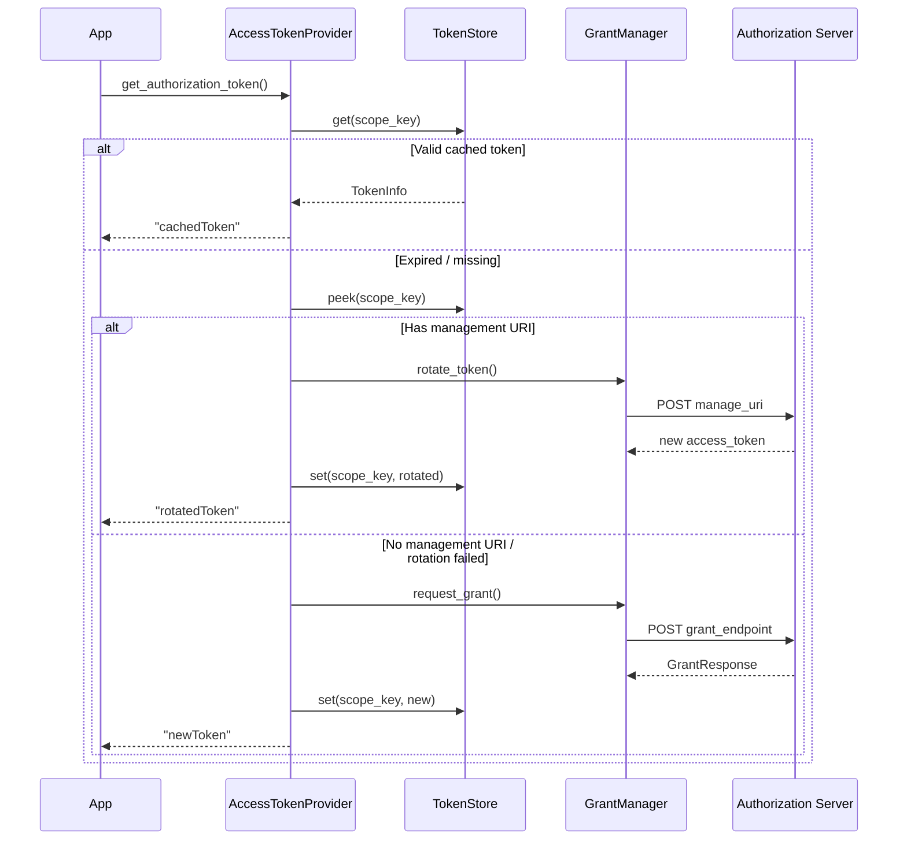

# Kiota GNAP Authentication Provider for Python

> A Kiota-compatible authentication provider implementing GNAP (RFC 9635) for automated Open Payments SDK generation in Python.

[](LICENSE)
[](https://www.rfc-editor.org/rfc/rfc9635)
[](https://www.python.org/)
[](https://github.com/REN-100/kiota-gnap-auth-python/actions)

## Overview

This package implements a [Kiota](https://learn.microsoft.com/en-us/openapi/kiota/) `AuthenticationProvider` that handles the complete GNAP authorization lifecycle for Open Payments APIs in Python. Designed as a direct counterpart to the [TypeScript provider](https://github.com/REN-100/kiota-gnap-auth-ts), ensuring cross-language parity.

Part of the **ShujaaPay GNAP Stack** — open-source tooling for the [Open Payments](https://openpayments.dev) ecosystem by [ShujaaPay](https://www.shujaapay.me).

## Features

- **Full GNAP lifecycle** — Grant requests, token acquisition, continuation, rotation, revocation, introspection, and grant deletion
- **Wallet address resolution** — Auto-discover auth server from Open Payments wallet addresses
- **Kiota-native** — Implements `AuthenticationProvider` interface for seamless SDK integration
- **HTTP Message Signatures** — Automatic RFC 9421 request signing with `tag="gnap"` (RFC 9635 §7.3.3)
- **Multi-algorithm keys** — Ed25519 (recommended) and ECDSA-P256 key proofs
- **Async-first** — Built on `asyncio` and `httpx` for modern Python
- **Context managers** — `async with` support for automatic resource cleanup
- **Token management** — In-memory token store with TTL auto-prune and proactive 30s grace refresh
- **Concurrent acquisition guard** — Prevents duplicate grants for simultaneous requests
- **Continuation polling** — `poll_continuation()` with `wait` interval support and `too_fast` backoff
- **Retry with backoff** — Configurable exponential retry for transient failures (429, 5xx)
- **Lifecycle events** — Event emitter for `token:acquired`, `token:rotated`, `grant:error`, etc.
- **Structured logging** — Python `logging` module integration (debug/info/warning)
- **Token flags** — Support for `bearer` and `durable` flags (RFC 9635 §2.1.1)
- **Content-Digest** — Automatic SHA-256 body digest header for request integrity (RFC 9530)
- **Interaction hash** — RFC 9635 §4.2.3 verification with timing-safe comparison
- **Open Payments optimized** — Wallet address identification, `identifier`, `limits` (debitAmount/receiveAmount/interval), client display
- **PEP 561 typed** — `py.typed` marker for full mypy/pyright support

## Installation

```bash
pip install shujaapay-kiota-gnap-auth
```

## Quick Start

```python
from kiota_gnap_auth import (
    GnapAuthenticationProvider,
    GnapAuthOptions,
    ClientKeyConfig,
    AccessRight,
    Amount,
    PaymentLimits,
    ClientDisplay,
    Algorithm,
)

# 1. Create the GNAP auth provider
auth_provider = GnapAuthenticationProvider(
    GnapAuthOptions(
        grant_endpoint="https://auth.wallet.example/",
        client_key=ClientKeyConfig(
            key_id="my-client-key",
            private_key=my_ed25519_private_key,
            algorithm=Algorithm.ED25519,
        ),
        access_rights=[
            AccessRight(
                type="incoming-payment",
                actions=["create", "read", "list", "complete"],
                identifier="https://wallet.example/alice",
            ),
            AccessRight(
                type="outgoing-payment",
                actions=["create", "read", "list"],
                identifier="https://wallet.example/alice",
                limits=PaymentLimits(
                    receiver="https://wallet.example/bob/incoming-payments/abc",
                    debit_amount=Amount(value="50000", asset_code="KES", asset_scale=2),
                    interval="R12/2024-01-01T00:00:00Z/P1M",
                ),
            ),
            AccessRight(type="quote", actions=["create", "read"]),
        ],
        wallet_address="https://wallet.example/alice",
        client_display=ClientDisplay(name="ShujaaPay", uri="https://www.shujaapay.me"),
    )
)

# 2. Use with Kiota-generated client
from kiota_http.httpx_request_adapter import HttpxRequestAdapter

adapter = HttpxRequestAdapter(auth_provider)
client = OpenPaymentsClient(adapter)

# 3. Make authenticated API calls — GNAP auth is automatic
payments = await client.incoming_payments.get()
```

### Wallet Address Auto-Discovery

```python
from kiota_gnap_auth import resolve_wallet_address, GnapAuthenticationProvider, GnapAuthOptions, ClientKeyConfig, AccessRight, Algorithm

# Resolve auth server from wallet address (Open Payments)
wallet_info = await resolve_wallet_address("https://ilp.rafiki.money/alice")
# wallet_info.auth_server -> "https://auth.rafiki.money"
# wallet_info.asset_code -> "USD"
# wallet_info.asset_scale -> 2

# Use discovered auth server
auth_provider = GnapAuthenticationProvider(
    GnapAuthOptions(
        grant_endpoint=wallet_info.auth_server,
        client_key=ClientKeyConfig(
            key_id="my-key",
            private_key=my_ed25519_private_key,
            algorithm=Algorithm.ED25519,
        ),
        access_rights=[
            AccessRight(
                type="incoming-payment",
                actions=["create", "read"],
                identifier=wallet_info.id,
            ),
        ],
        wallet_address=wallet_info.id,
    )
)
```

### Context Manager Usage

```python
async with GnapAuthenticationProvider(GnapAuthOptions(...)) as auth:
    adapter = HttpxRequestAdapter(auth)
    client = OpenPaymentsClient(adapter)
    payments = await client.incoming_payments.get()
# HTTP client automatically closed
```

### Using ECDSA-P256 Keys

```python
from kiota_gnap_auth import GnapAuthenticationProvider, GnapAuthOptions, ClientKeyConfig, AccessRight, Algorithm

auth_provider = GnapAuthenticationProvider(
    GnapAuthOptions(
        grant_endpoint="https://auth.wallet.example/",
        client_key=ClientKeyConfig(
            key_id="my-ec-key",
            private_key=my_ecdsa_p256_private_key,  # PEM-encoded P-256 key
            algorithm=Algorithm.ECDSA_P256_SHA256,    # ES256
        ),
        access_rights=[
            AccessRight(type="incoming-payment", actions=["create", "read"]),
        ],
    )
)
```

### FastAPI Integration

```python
from fastapi import Depends, FastAPI

app = FastAPI()

async def get_op_client():
    auth = GnapAuthenticationProvider(GnapAuthOptions(...))
    adapter = HttpxRequestAdapter(auth)
    return OpenPaymentsClient(adapter)

@app.post("/send-payment")
async def send_payment(client=Depends(get_op_client)):
    result = await client.outgoing_payments.create(...)
    return result
```

## Architecture

```
                    Kiota SDK (Python)
                          |
                          v
          +-------------------------------+
          | GnapAuthenticationProvider     |
          |  - authenticate_request()     |
          |  - allowed_hosts validation   |
          +-------------------------------+
                          |
             +------------+------------+
             |                         |
             v                         v
    +--------------------+    +--------------------+
    | GnapAccessToken    |    | HTTP Message       |
    | Provider           |    | Signatures         |
    |  - cache-first     |    |  - RFC 9421        |
    |  - auto-refresh    |    |  - tag="gnap"      |
    |  - proactive renew |    |  - Content-Digest  |
    |  - concurrent lock |    +--------------------+
    +--------------------+          (cryptography)
             |
    +--------------------+    +--------------------+
    | GnapGrantManager   |    | Events             |
    |  - request_grant   |    |  - token:acquired  |
    |  - continue_grant  |    |  - token:rotated   |
    |  - rotate_token    |    |  - grant:error     |
    |  - revoke_token    |    +--------------------+
    |  - delete_grant    |
    +--------------------+
             |
    +--------------------+
    | InMemoryTokenStore |
    |  - TTL auto-prune  |
    |  - peek (rotation) |
    +--------------------+
```

### Token Acquisition Flow



[ShujaaPay](https://www.shujaapay.me) uses this provider to power authenticated Open Payments interactions across our multi-currency fintech platform:

**🔐 SDK-First Architecture** — ShujaaPay's gateway uses Kiota-generated SDKs with this auth provider, eliminating manual GNAP implementation and ensuring every API call is cryptographically signed.

**💸 Cross-Wallet Payments** — When initiating outgoing payments to Rafiki-based wallets, the provider automatically handles grant negotiation, token acquisition, and HTTP signature generation — developers write `await client.outgoing_payments.create(...)` and auth is handled transparently.

**🔄 Token Lifecycle** — The provider's 30-second grace period proactive refresh ensures uninterrupted payment streams for Web Monetization, preventing mid-session token expiration during streaming micropayments.

> This provider exists because building GNAP auth from scratch requires understanding 160+ pages of RFCs. We built it once, tested it against real Open Payments infrastructure, and now any fintech can use it out of the box.

## API Reference

### `GnapAuthenticationProvider`

Main entry point implementing Kiota's `AuthenticationProvider` interface.

```python
auth_provider = GnapAuthenticationProvider(options: GnapAuthOptions)

# Access lifecycle events
auth_provider.events.on("token:acquired", lambda data: print(data))
```

### `GnapAccessTokenProvider`

Lower-level provider for token acquisition and management.

```python
provider = GnapAccessTokenProvider(grant_manager, token_store, access_rights)

# Get a token (from cache, rotation, or new grant)
token = await provider.get_authorization_token(url)

# Continue after user interaction
token = await provider.continue_grant(continue_uri, continue_token, interact_ref)

# Poll for continuation
token = await provider.poll_continuation(continue_uri, continue_token, interact_ref)
```

### `GnapGrantManager`

Direct grant lifecycle operations.

```python
manager = GnapGrantManager(
    grant_endpoint="https://auth.example/",
    client_key=client_key,
    wallet_address="https://wallet.example/alice",
    client_display=ClientDisplay(name="ShujaaPay"),
)

# Request, continue, rotate, revoke, delete
grant = await manager.request_grant(access_rights, interaction, flags)
result = await manager.continue_grant(uri, token, interact_ref)
new_token = await manager.rotate_token(manage_uri, current_token)
await manager.revoke_token(manage_uri, current_token)
await manager.delete_grant(continue_uri, continue_token)
```

### `InMemoryTokenStore`

Default token storage with TTL-aware retrieval.

```python
store = InMemoryTokenStore()
await store.set("scope", token_info)
token = await store.get("scope")   # Returns None if expired
peeked = await store.peek("scope") # Returns even if expired (for rotation)
await store.clear()                # Logout cleanup
```

## Project Structure

```
src/kiota_gnap_auth/
  __init__.py                       # Public exports
  _logging.py                       # Library-level logging (NullHandler)
  gnap_auth_provider.py             # Kiota AuthenticationProvider + AllowedHosts
  gnap_access_token_provider.py     # Token lifecycle with concurrency guard + polling
  gnap_grant_manager.py             # GNAP grant lifecycle (RFC 9635 §2-6)
  http_signature_signer.py          # RFC 9421 signing + JWK export + Content-Digest
  token_store.py                    # In-memory token storage with TTL + peek
  wallet_address.py                 # Open Payments wallet address resolution
  errors.py                         # GnapError, GnapInteractionRequiredError (§3.6)
  retry.py                          # Exponential backoff retry policy
  events.py                         # Typed event emitter for lifecycle events
  interaction_hash.py               # Interaction hash verification (§4.2.3)
  types.py                          # Python dataclasses + Open Payments types
  py.typed                          # PEP 561 marker
tests/
  test_types.py                     # 15 tests: Amount, PaymentLimits, AccessRight, flags
  test_errors.py                    # 16 tests: error types, parsing, recovery
  test_token_store.py               # 10 tests: CRUD, TTL, auto-prune, peek
  test_grant_manager.py             # 26 tests: grant/continue/rotate/revoke/introspect/app/ctx
  test_access_token_provider.py     # 14 tests: cache, rotation, concurrency, events
  test_interaction_hash.py          # 8 tests: SHA-256/512, tamper, injection
  test_retry.py                     # 7 tests: retry, backoff, exhaustion
  test_wallet_address.py            # 9 tests: resolution, $format, HTTP, KES
```

## Related Projects

This library is part of the **ShujaaPay GNAP Stack** by [ShujaaPay](https://www.shujaapay.me), contributing open-source tooling to the [Open Payments](https://openpayments.dev) ecosystem:

| Repo | Description | Status |
|------|-------------|--------|
| [`gnap-openapi-security-scheme`](https://github.com/REN-100/gnap-openapi-security-scheme) | `x-gnap` OpenAPI extension for GNAP security | In progress |
| [`kiota-gnap-auth-ts`](https://github.com/REN-100/kiota-gnap-auth-ts) | Kiota GNAP auth provider (TypeScript) | In progress |
| **`kiota-gnap-auth-python`** | **This repo** — Kiota GNAP auth provider (Python) | In progress |
| [`http-message-signatures-ts`](https://github.com/REN-100/http-message-signatures-ts) | RFC 9421 signing library (dependency) | In progress |

## Contributing

See [CONTRIBUTING.md](CONTRIBUTING.md).

## License

MIT License — see [LICENSE](LICENSE).
